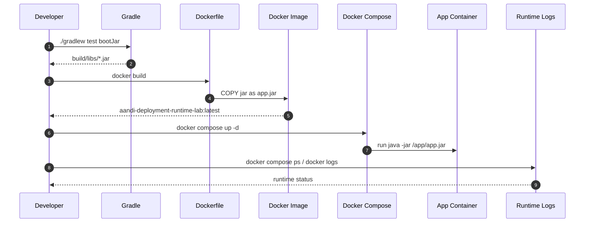
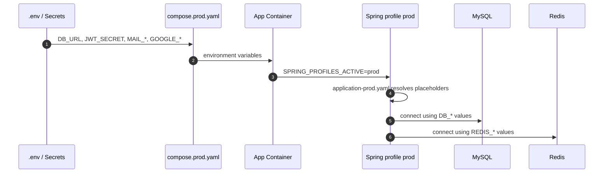
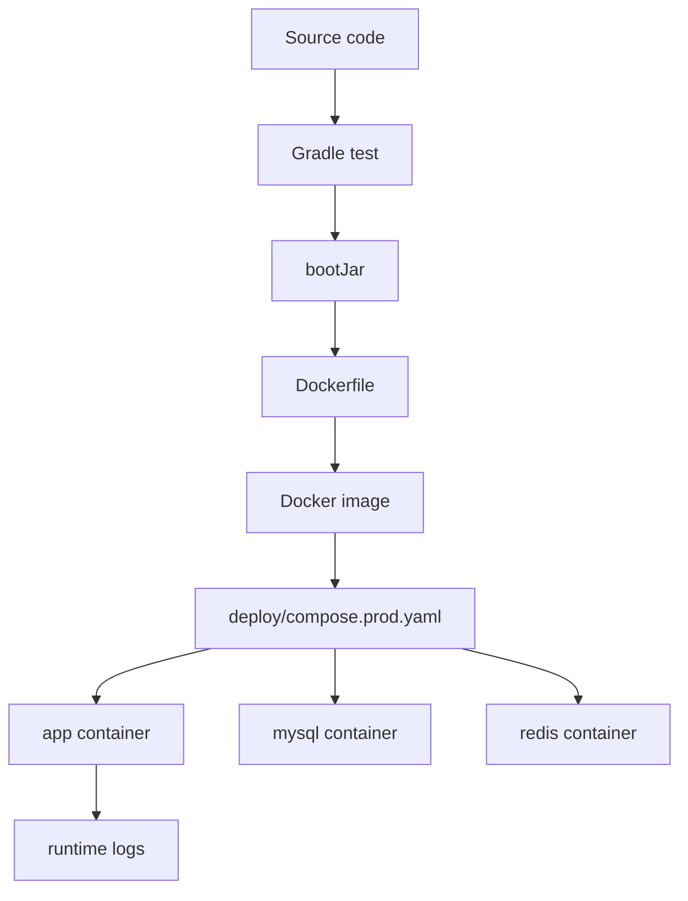

# 이론 정리

> 이번 시퀀스는 로컬에서 실행하던 Spring Boot 애플리케이션을 jar, Docker image, 운영 profile, compose 실행 단위로 묶는 단계입니다.
> 핵심은 “명령이 끝났다”가 아니라 “서버 환경에서도 필요한 설정을 주입받아 실제로 기동되는가”를 확인하는 것입니다.

## 1. Problem - 왜 배포 실행 단위가 필요한가

로컬에서는 `./gradlew bootRun`으로 애플리케이션을 실행할 수 있습니다. 하지만 운영 환경에서는 JDK 버전, DB 주소, Redis 주소, JWT secret, OAuth secret, SMTP 계정이 달라집니다.

소스코드만 서버에 복사하면 실행 환경 차이를 사람이 매번 맞춰야 합니다. 운영 비밀값을 설정 파일에 직접 쓰면 Git 히스토리와 리뷰 화면에 남습니다. `docker compose up -d`가 끝났더라도 애플리케이션이 DB 연결 실패로 바로 종료될 수 있습니다.

이번 시퀀스의 문제는 아래와 같습니다.

- Spring Boot 실행 결과물을 jar로 만듭니다.
- jar를 Docker image 안에서 실행 가능하게 만듭니다.
- 운영 설정은 profile과 환경변수로 분리합니다.
- 앱, MySQL, Redis를 compose 실행 묶음으로 올립니다.
- 컨테이너 상태와 로그로 실제 기동 여부를 확인합니다.

## 2. Analyze - 로컬 실행과 운영 실행에서 달라지는 것

| 기준 | 로컬 실행 | 운영/컨테이너 실행 |
|---|---|---|
| 실행 명령 | `./gradlew bootRun` | `java -jar /app/app.jar` |
| 실행 결과물 | 소스와 Gradle task 중심 | bootJar 결과물 |
| 환경 | 개발자 PC 설정 | Docker image와 container 환경 |
| 설정값 | local yaml, 기본값 | 환경변수와 prod profile |
| 의존 서비스 | local compose 또는 직접 실행 | compose 서비스와 healthcheck |
| 성공 판정 | 터미널 실행 여부 | 테스트, 빌드, 컨테이너 상태, 로그 |

이번 시퀀스는 CI/CD 전체 자동화를 완성하는 단계가 아닙니다. 먼저 수동으로도 설명 가능한 배포 실행 단위를 만들고, 다음 시퀀스에서 workflow와 script로 반복 가능하게 고정합니다.

## 3. API / 실행 시퀀스 다이어그램

### 3.1 jar에서 컨테이너 실행까지

배포 확인은 build에서 끝나지 않습니다. jar가 만들어지고 image가 만들어져도, 실제 container 로그에서 설정 누락이나 DB 연결 실패가 드러날 수 있습니다.

### 3.2 운영 설정 주입 흐름

`application-prod.yaml`은 실제 비밀값을 담는 파일이 아닙니다. 운영에서 어떤 값이 필요하고 어떤 이름으로 주입받는지 약속하는 파일입니다.

## 4. 계층 / DTO / 메시지 흐름

이번 시퀀스는 API DTO보다 jar, image, 환경변수 같은 실행 메시지가 중심입니다. 그래서 DTO 흐름은 “요청/응답 객체”가 아니라 “설정 값과 실행 artifact가 어느 계층으로 전달되는가”로 읽습니다.

### 4.1 배포 실행 계층 흐름

| 계층 | 책임 | 직접 확인할 파일 |
|---|---|---|
| Build | 테스트와 jar 결과물을 만듭니다. | `build.gradle.kts`, `gradlew` |
| Image | jar와 JRE 실행 환경을 묶습니다. | `Dockerfile` |
| Runtime config | 운영 설정 값을 환경변수로 받습니다. | `application-prod.yaml` |
| Orchestration | 앱, MySQL, Redis를 함께 실행합니다. | `deploy/compose.prod.yaml` |
| Verification | 컨테이너 상태와 로그로 기동 여부를 확인합니다. | `docker compose ps`, `docker logs` |

### 4.2 설정 메시지 흐름

| 설정 값 | 어디에서 들어오는가 | 어디에서 쓰이는가 |
|---|---|---|
| `SPRING_PROFILES_ACTIVE` | compose environment | prod profile 활성화 |
| `DB_URL`, `DB_USERNAME`, `DB_PASSWORD` | `.env` 또는 Secrets | `spring.datasource.*` |
| `REDIS_HOST`, `REDIS_PORT` | `.env` 또는 Secrets | `spring.data.redis.*` |
| `JWT_SECRET` | Secrets | `jwt.secret` |
| `MAIL_*` | Secrets | `spring.mail.*` |
| `GOOGLE_CLIENT_*` | Secrets | OAuth2 client 설정 |
| `APP_*_URL` | Secrets | 프론트 redirect와 password reset link |

## 5. Action - 이번 구현에서 연결할 지점

### 5.1 jar 실행 단위 확인

`./gradlew test bootJar`는 배포 전 가장 먼저 확인할 기준입니다. 테스트가 실패하면 Dockerfile보다 애플리케이션 기본 동작을 먼저 봐야 합니다.

확인 질문:

- `build/libs` 아래 실행할 jar가 만들어지나요?
- 테스트 실패와 Docker build 실패를 구분해 읽을 수 있나요?
- jar 경로가 Dockerfile의 `COPY` 경로와 맞나요?

### 5.2 Dockerfile로 실행 환경 고정

`Dockerfile`은 JRE image, 작업 디렉터리, jar 복사, 실행 명령을 정합니다. Docker는 jar를 대체하는 것이 아니라 jar가 실행될 환경을 함께 묶습니다.

확인 질문:

- 컨테이너 안에서 jar 이름은 무엇인가요?
- `ENTRYPOINT`는 어떤 Java 명령을 실행해야 하나요?
- 컨테이너가 외부에 열 포트는 무엇인가요?

### 5.3 prod profile과 compose 설정

`application-prod.yaml`과 `deploy/compose.prod.yaml`은 운영 값의 이름과 전달 경로를 맞춥니다. 실제 secret 값은 코드나 문서에 쓰지 않습니다.

확인 질문:

- prod profile이 활성화되는 값은 어디에서 들어오나요?
- DB, Redis, JWT, mail, OAuth 값이 모두 환경변수로 주입되나요?
- compose 실행 후 `ps`와 로그로 기동 상태를 확인하나요?

## 6. Result - 무엇을 확인하고 어떤 한계가 남는가

이번 시퀀스를 마치면 아래를 설명할 수 있어야 합니다.

- jar와 Docker image의 관계
- Dockerfile이 실행 환경을 고정하는 방식
- `application-prod.yaml`이 실제 secret 저장소가 아니라 환경변수 연결 지점인 이유
- compose가 앱, MySQL, Redis 실행 묶음을 만드는 방식
- 배포 명령 성공과 애플리케이션 정상 기동이 다른 기준인 이유

남는 한계도 분명히 봅니다.

- GitHub Actions 배포 자동화의 세부 script 안정화는 다음 시퀀스의 중심 범위입니다.
- 실제 EC2, 도메인, TLS, 운영 DB 백업 전략은 이번 범위가 아닙니다.
- secret 값 자체는 문서에 적지 않고 이름과 주입 위치만 다룹니다.

## 7. 실무 포인트

- Docker image는 소스코드 묶음이 아니라 실행 가능한 artifact와 runtime 환경의 묶음입니다.
- 운영 설정 파일에는 값 자체보다 값의 이름과 필수 여부가 드러나야 합니다.
- 배포에서 “성공”은 명령 종료, container running, application ready를 구분해서 봅니다.
- 로그 확인은 배포 후 추가 작업이 아니라 성공 판정의 일부입니다.
- secret은 GitHub Secrets, 서버 `.env`, cloud secret manager처럼 코드 밖에 둡니다.
- compose의 `depends_on`은 실행 순서를 돕지만 애플리케이션 readiness 전체를 보장하지는 않습니다.

## 8. 용어 정리

### bootJar

- 뜻
  Spring Boot 애플리케이션을 실행 가능한 jar로 만드는 Gradle task입니다.
- 왜 중요한가
  배포에서는 소스 폴더가 아니라 실행 결과물이 필요합니다.
- 이번 코드에서는 어디에 보이는가
  `./gradlew test bootJar`, `build/libs/*.jar`
- 짧은 상황 예시
  Dockerfile은 `build/libs` 아래 jar를 image 안으로 복사합니다.

### Dockerfile

- 뜻
  Docker image를 만들기 위한 빌드 절차 파일입니다.
- 왜 중요한가
  어떤 JRE에서 어떤 jar를 어떤 명령으로 실행할지 고정합니다.
- 이번 코드에서는 어디에 보이는가
  `Dockerfile`
- 짧은 상황 예시
  `ENTRYPOINT ["java", "-jar", "/app/app.jar"]` 형태로 컨테이너 기본 실행 명령을 정합니다.

### Profile

- 뜻
  실행 환경별 설정 묶음을 선택하는 방식입니다.
- 왜 중요한가
  로컬 설정과 운영 설정이 섞이지 않게 합니다.
- 이번 코드에서는 어디에 보이는가
  `application-prod.yaml`, `SPRING_PROFILES_ACTIVE`
- 짧은 상황 예시
  운영 컨테이너는 `SPRING_PROFILES_ACTIVE=prod`로 prod 설정을 사용합니다.

### Environment Variable

- 뜻
  코드 밖에서 실행 시점에 주입하는 값입니다.
- 왜 중요한가
  DB password, JWT secret 같은 값을 Git에 남기지 않게 합니다.
- 이번 코드에서는 어디에 보이는가
  `deploy/compose.prod.yaml`, `application-prod.yaml`
- 짧은 상황 예시
  `${DB_PASSWORD}`는 실제 비밀번호가 아니라 실행 시점에 들어올 자리입니다.

### Runtime Log

- 뜻
  실행 중인 컨테이너와 애플리케이션이 남기는 기록입니다.
- 왜 중요한가
  포트 충돌, DB 연결 실패, secret 누락 같은 문제를 배포 후 확인할 수 있습니다.
- 이번 코드에서는 어디에 보이는가
  `docker compose ps`, `docker logs --tail 50 aandi-app`
- 짧은 상황 예시
  compose 명령은 끝났지만 로그에 DB 연결 실패가 있으면 배포 성공으로 볼 수 없습니다.

## 9. 다음 구현으로 연결되는 지점

`docs/implementation.md`에서는 Dockerfile, `application-prod.yaml`, `deploy/compose.prod.yaml`의 TODO를 채우며 실행 단위와 설정 주입 경로를 맞춥니다. 구현 후에는 `./gradlew test bootJar`, Docker build, compose 실행, 로그 확인을 한 흐름으로 설명해야 합니다.

멘토용 설명 포인트

- 멘티가 Docker를 jar 대체물로 이해하면 jar를 감싸 실행 환경을 고정한다는 관점으로 다시 설명합니다.
- secret 값 자체를 예시로 쓰기보다 secret 이름과 주입 위치를 구분하게 합니다.
- 로그 확인을 “추가 작업”이 아니라 배포 성공 판정의 일부로 설명하게 합니다.
- `depends_on`과 readiness의 차이를 간단한 DB 연결 실패 예시로 질문합니다.

