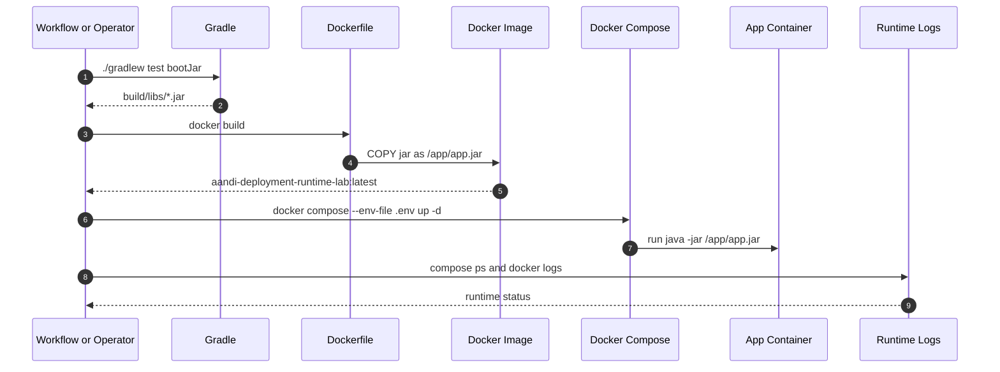
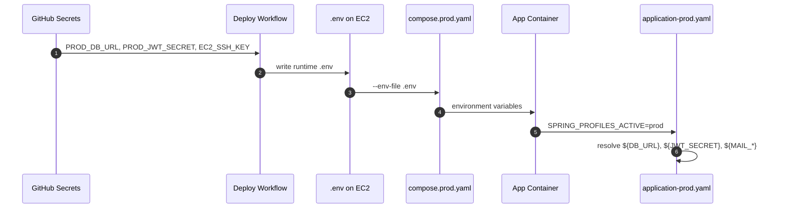
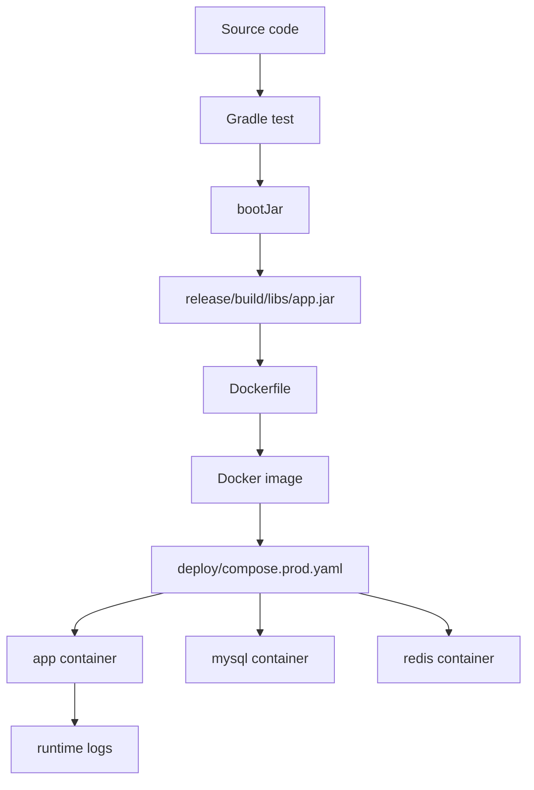

# 이론 정리

> 이번 시퀀스는 로컬에서 실행하던 Spring Boot 애플리케이션을 jar, Docker image, 운영 profile, compose 실행 단위로 묶는 단계입니다.
> 이 브랜치에서는 완성된 Dockerfile, `application-prod.yaml`, `deploy/compose.prod.yaml`, 배포 workflow 조각을 기준으로 운영 실행 흐름을 비교합니다.

## 1. Problem - 왜 배포 실행 단위가 필요한가

로컬에서는 `./gradlew bootRun`으로 애플리케이션을 실행할 수 있습니다. 운영 환경에서는 JDK 버전, DB 주소, Redis 주소, JWT secret, OAuth secret, SMTP 계정이 달라집니다.

운영 배포에서 문제는 “코드가 있다”가 아니라 “서버가 같은 방식으로 실행할 수 있다”입니다. 소스코드만 복사하면 실행 환경 차이를 사람이 맞춰야 하고, secret을 설정 파일에 쓰면 Git에 남습니다. `docker compose up -d`가 끝나도 앱이 바로 종료될 수 있으므로 로그 확인도 필요합니다.

정답 구현은 아래 기준을 보여줍니다.

- `./gradlew test bootJar`로 테스트와 jar를 먼저 확인합니다.
- `Dockerfile`이 jar를 `/app/app.jar`로 복사하고 Java로 실행합니다.
- `application-prod.yaml`은 운영 값을 환경변수로만 받습니다.
- `deploy/compose.prod.yaml`은 app, MySQL, Redis를 함께 실행합니다.
- workflow는 release bundle, SSH key, 업로드, EC2 실행, 로그 확인을 순서대로 연결합니다.

## 2. Analyze - 정답 구현에서 선택한 기준

| 기준 | 정답 구현의 선택 | 이유 |
|---|---|---|
| runtime image | `eclipse-temurin:21-jre` | 빌드가 끝난 jar 실행에 필요한 JRE만 사용합니다. |
| jar 위치 | `build/libs/*.jar` -> `/app/app.jar` | Dockerfile 실행 명령을 단순하게 유지합니다. |
| prod profile | `SPRING_PROFILES_ACTIVE=prod` | 운영 설정을 local 설정과 분리합니다. |
| secret 주입 | GitHub Secrets 또는 `.env` | 실제 값을 코드에 남기지 않습니다. |
| compose 구성 | app, mysql, redis | 현재 앱 의존 서비스를 함께 실행합니다. |
| 성공 판정 | test, bootJar, container ps, logs | 배포 명령 종료와 정상 기동을 구분합니다. |

이 기준은 다음 시퀀스의 CI/CD 자동화로 이어집니다. 이번 시퀀스는 자동화 자체보다 자동화할 수 있는 수동 실행 흐름을 먼저 명확히 합니다.

## 3. API / 실행 시퀀스 다이어그램

### 3.1 jar에서 컨테이너 실행까지

정답 구현의 핵심은 Dockerfile 세 줄을 외우는 것이 아니라, jar가 image 안으로 들어가고 container가 그 jar를 실행한다는 연결을 설명하는 것입니다.

### 3.2 GitHub Secrets에서 prod profile까지

GitHub Secrets와 `.env`는 값을 보관하거나 전달하는 위치이고, `application-prod.yaml`은 Spring이 어떤 이름으로 값을 읽을지 정의하는 위치입니다.

## 4. 계층 / DTO / 메시지 흐름

이번 시퀀스는 API DTO보다 jar, image, release bundle, 환경변수 같은 실행 메시지가 중심입니다. 그래서 DTO 흐름은 “요청/응답 객체”가 아니라 “설정 값과 실행 artifact가 어느 계층으로 전달되는가”로 읽습니다.

### 4.1 배포 실행 계층 흐름

| 계층 | 정답 구현에서 확인할 책임 | 주요 파일 |
|---|---|---|
| Build | 테스트와 jar 결과물을 만듭니다. | `build.gradle.kts`, `gradlew` |
| Image | jar와 JRE 실행 환경을 묶습니다. | `Dockerfile` |
| Runtime config | 운영 설정 값을 환경변수로 받습니다. | `application-prod.yaml` |
| Orchestration | 앱, MySQL, Redis를 함께 실행합니다. | `deploy/compose.prod.yaml` |
| Workflow handoff | release bundle을 만들고 서버로 전달합니다. | `.github/workflows/deploy.yml` |
| Verification | 컨테이너 상태와 로그로 기동 여부를 확인합니다. | `docker compose ps`, `docker logs` |

### 4.2 설정 메시지 흐름

| 설정 값 | 전달 위치 | Spring에서 쓰는 곳 |
|---|---|---|
| `SPRING_PROFILES_ACTIVE=prod` | `.env`, compose environment | prod profile 활성화 |
| `DB_URL`, `DB_USERNAME`, `DB_PASSWORD` | Secrets -> `.env` -> container | `spring.datasource.*` |
| `REDIS_HOST`, `REDIS_PORT` | Secrets -> `.env` -> container | `spring.data.redis.*` |
| `JWT_SECRET`, `JWT_EXPIRATION_MS` | Secrets -> `.env` -> container | `jwt.*` |
| `MAIL_*` | Secrets -> `.env` -> container | `spring.mail.*` |
| `GOOGLE_CLIENT_*` | Secrets -> `.env` -> container | OAuth2 client 설정 |
| `APP_*_URL` | Secrets -> `.env` -> container | redirect와 reset link |

## 5. Action - 정답 구현에서 비교할 코드 흐름

### 5.1 Dockerfile

정답 Dockerfile은 JRE image를 사용하고, jar를 `/app/app.jar`로 복사한 뒤 Java 명령으로 실행합니다.

비교 포인트:

- `ARG JAR_FILE=build/libs/*.jar`로 build 결과물을 받을 수 있나요?
- `COPY ${JAR_FILE} app.jar`가 컨테이너 작업 디렉터리 기준으로 맞나요?
- `ENTRYPOINT`가 `/app/app.jar`를 실행하나요?
- `EXPOSE 8080`이 애플리케이션 포트와 맞나요?

### 5.2 prod profile

`application-prod.yaml`은 실제 secret 값을 담지 않고 placeholder만 둡니다. 값은 컨테이너 환경변수로 들어옵니다.

비교 포인트:

- DB, Redis, JWT, mail, OAuth, app URL이 모두 환경변수로 연결되어 있나요?
- 기본값이 실제 운영 비밀값으로 남아 있지 않나요?
- 로그 level과 JPA 설정이 운영 실행 기준에 맞게 과하지 않나요?

### 5.3 compose와 workflow handoff

`deploy/compose.prod.yaml`은 app, mysql, redis를 함께 실행하고, workflow는 release bundle을 만든 뒤 EC2에 업로드합니다.

비교 포인트:

- app container가 `SPRING_PROFILES_ACTIVE`와 필요한 환경변수를 모두 받나요?
- MySQL healthcheck와 Redis service가 앱 실행 순서에 도움을 주나요?
- workflow가 test/bootJar, bundle, upload, deploy, logs 순서를 지키나요?
- 로그 확인이 배포 성공 판정에 포함되어 있나요?

## 6. Result - 확인할 결과와 남은 한계

정답 구현 기준으로 아래를 확인합니다.

- jar가 `bootJar`로 만들어집니다.
- Docker image가 jar를 `/app/app.jar`로 포함합니다.
- app container가 prod profile과 환경변수로 실행됩니다.
- MySQL과 Redis가 compose 서비스로 함께 올라갑니다.
- 배포 후 `docker compose ps`와 `docker logs`로 상태를 확인합니다.

남는 한계도 함께 봅니다.

- workflow 안정화, rollback, health endpoint 기반 verify는 다음 시퀀스에서 더 다룹니다.
- 실제 EC2, 도메인, TLS, 운영 DB 백업 전략은 이번 범위가 아닙니다.
- GitHub Secrets 값 자체는 문서와 코드에 남기지 않습니다.

## 7. 실무 포인트

- Docker image는 jar를 대체하지 않고 jar 실행 환경을 고정합니다.
- prod profile은 운영 값을 분리하는 장치이지 secret 저장소가 아닙니다.
- compose의 `depends_on`은 컨테이너 시작 순서를 도울 뿐 애플리케이션 readiness를 완전히 보장하지 않습니다.
- 배포 성공 판정은 build 성공, container 실행, application 로그 확인을 나눠 봅니다.
- workflow에서 secret 값을 파일로 쓸 때는 로그 노출과 파일 권한을 함께 봐야 합니다.
- 운영에서 compose로 DB까지 함께 올릴지, 외부 관리형 DB를 쓸지는 별도 인프라 결정입니다.

## 8. 용어 정리

### bootJar

- 뜻
  Spring Boot 애플리케이션을 실행 가능한 jar로 만드는 Gradle task입니다.
- 왜 중요한가
  Docker image는 이 jar를 실행 단위로 포함합니다.
- 이번 코드에서는 어디에 보이는가
  `./gradlew test bootJar`, `build/libs/*.jar`
- 짧은 상황 예시
  workflow가 jar를 release bundle에 복사한 뒤 서버에서 image로 만듭니다.

### Dockerfile

- 뜻
  Docker image를 만들기 위한 빌드 절차 파일입니다.
- 왜 중요한가
  어떤 JRE에서 어떤 jar를 어떤 명령으로 실행할지 고정합니다.
- 이번 코드에서는 어디에 보이는가
  `Dockerfile`
- 짧은 상황 예시
  `ENTRYPOINT ["java", "-jar", "/app/app.jar"]`가 컨테이너의 기본 실행 명령입니다.

### Profile

- 뜻
  실행 환경별 설정 묶음을 선택하는 방식입니다.
- 왜 중요한가
  로컬 설정과 운영 설정이 섞이지 않게 합니다.
- 이번 코드에서는 어디에 보이는가
  `application-prod.yaml`, `SPRING_PROFILES_ACTIVE`
- 짧은 상황 예시
  운영 컨테이너는 `prod` profile로 DB와 Redis 설정을 환경변수에서 읽습니다.

### GitHub Secrets

- 뜻
  GitHub Actions 실행 시점에 참조하는 비밀값 저장소입니다.
- 왜 중요한가
  SSH key, DB password, JWT secret 같은 값을 코드에 남기지 않게 합니다.
- 이번 코드에서는 어디에 보이는가
  `.github/workflows/deploy.yml`
- 짧은 상황 예시
  workflow가 `${{ secrets.PROD_DB_PASSWORD }}` 값을 서버 `.env`로 전달합니다.

### Runtime Log

- 뜻
  실행 중인 컨테이너와 애플리케이션이 남기는 기록입니다.
- 왜 중요한가
  포트 충돌, DB 연결 실패, secret 누락 같은 문제를 배포 후 확인할 수 있습니다.
- 이번 코드에서는 어디에 보이는가
  `docker compose ps`, `docker logs --tail 50 aandi-app`
- 짧은 상황 예시
  compose 명령은 끝났지만 로그에 DB 연결 실패가 있으면 배포 성공으로 볼 수 없습니다.

## 9. 다음 구현으로 연결되는 지점

`docs/answer-guide.md`를 볼 때는 Dockerfile의 문법보다 jar가 image에 들어가고, compose가 환경변수를 전달하며, 로그가 최종 기동 판정으로 이어지는 순서를 먼저 확인합니다. 다음 시퀀스에서는 이 수동 흐름을 workflow와 script로 더 안정적으로 자동화합니다.

멘토용 설명 포인트

- starter 구현과 비교할 때 Dockerfile의 세 줄을 외우게 하기보다 jar가 image 안에서 실행되는 순서를 설명하게 합니다.
- secret 값 자체를 예시로 쓰지 않고 secret 이름과 주입 위치를 구분하게 합니다.
- 로그 확인을 “추가 작업”이 아니라 배포 성공 판정의 일부로 설명하게 합니다.
- workflow 단계는 자동화 자체보다 수동 배포 흐름을 어떤 순서로 고정했는지 중심으로 리뷰합니다.

