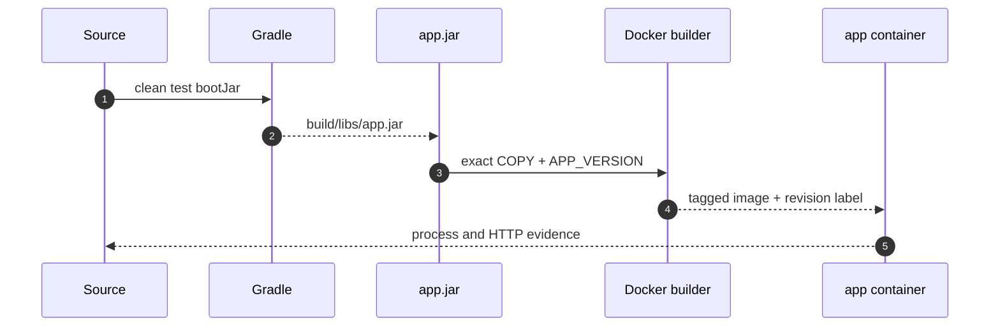
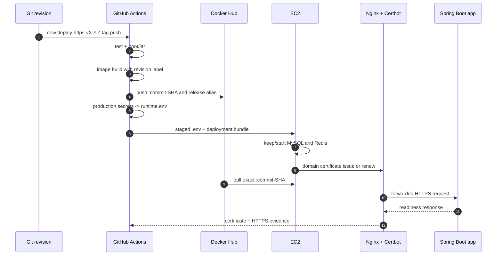

# Docker Runtime과 CI/CD 이론 정리

로컬에서 실행되는 source는 그대로 배포 단위가 되지 않습니다.
이번 랩은 검증된 source를 실행 가능한 JAR로 만들고, 같은 JAR를 담은 이미지를 Docker Hub를 통해 EC2까지 전달한 뒤 실제 실행 결과를 확인합니다.

이 토픽은 implementation 브랜치를 따로 두지 않습니다.
`09-answer`는 `deploy-v1.0.3`의 EC2 `:8080` HTTP Docker Compose 배포 기준에 고정합니다.
`10-answer`는 같은 commit에서 시작해 Nginx, 도메인과 HTTPS를 추가한 완성 상태입니다.

<a id="seq-09"></a>

## 09. 재현 가능한 실행 단위를 만듭니다



| 단계 | 들어온 것 | 한 일 | 나간 것 또는 상태 |
| --- | --- | --- | --- |
| 1 | source와 test | `clean test bootJar` 실행 | 검증된 `app.jar` |
| 2 | `app.jar`와 Dockerfile | exact COPY와 revision label 기록 | tagged image |
| 3 | image와 runtime `.env` | Compose로 app process 시작 | running 또는 기동 실패 |
| 4 | 실행 중인 app | container와 HTTP 상태 확인 | runtime 성공 또는 첫 실패 경계 |

### JAR 이름은 하나로 고정합니다

Spring Boot 프로젝트는 executable JAR와 plain JAR가 함께 생길 수 있습니다.
Dockerfile이 wildcard로 두 파일 중 하나를 우연히 고르면 build 결과를 재현하기 어렵습니다.

이 레포는 다음 계약을 사용합니다.

- `bootJar` 결과는 `build/libs/app.jar`입니다.
- plain `jar` task는 비활성화합니다.
- Dockerfile은 `build/libs/app.jar`만 복사합니다.
- `.dockerignore`는 다른 build 결과를 제외하되 `app.jar`는 context에 포함합니다.

```text
source -> test -> build/libs/app.jar -> Dockerfile COPY -> image
```

JAR 파일명이 바뀌거나 파일이 없으면 Docker build가 바로 실패하므로 잘못된 산출물이 다음 단계로 넘어가지 않습니다.

### image에는 source revision을 남깁니다

Docker tag만으로는 컨테이너 안의 코드가 어느 commit에서 만들어졌는지 증명하기 어렵습니다.
그래서 image build 시 `APP_VERSION`을 전달하고 OCI label에 기록합니다.

```dockerfile
ARG APP_VERSION=local
LABEL org.opencontainers.image.revision="${APP_VERSION}"
COPY build/libs/app.jar /app/app.jar
```

로컬에서는 `local`, GitHub Actions에서는 `${GITHUB_SHA}`가 revision이 됩니다.
배포 검증은 tag뿐 아니라 이 label도 확인합니다.

### image와 runtime config의 책임은 다릅니다

image에는 실행 코드와 Java runtime을 넣습니다.
DB 비밀번호, JWT secret, OAuth client secret 같은 환경별 값은 image에 넣지 않고 Compose와 `.env`로 주입합니다.

| 구분 | 저장할 것 | 저장하지 않을 것 |
| --- | --- | --- |
| Docker image | `app.jar`, Java runtime, ENTRYPOINT, revision label | 운영 비밀번호와 token |
| Compose | service 관계, port, environment 변수 이름 | 실제 secret 값 |
| GitHub `production` Environment | 운영 DB, JWT, OAuth, Mail 값 | source와 JAR |
| EC2 `.env` | Actions가 전달한 현재 runtime 값 | source, JAR, GitHub token |

Actions는 개별 Secret과 Variable을 로그에 출력하지 않고 runtime `.env`로 조립합니다.
검증된 파일만 EC2의 `.env.next`로 전송하고 권한을 `600`으로 제한한 뒤 기존 `.env`와 원자적으로 교체합니다.

[Visual Lab에서 runtime 경계를 확인하기](./visual-lab/sequences/09/)

<a id="seq-10"></a>

## 10. 같은 image를 HTTPS 진입점까지 배포합니다

EC2에서 JAR를 받아 image를 다시 만들면 Actions가 검증한 결과와 서버가 실행한 결과 사이에 새 build가 생깁니다.
이번 랩은 Actions가 image를 한 번만 만들고, Docker Hub가 그 image를 전달하며, Nginx가 외부 HTTPS 요청을 같은 app container로 전달하도록 책임을 나눕니다.



| 단계 | 들어온 것 | 한 일 | 나간 것 또는 상태 |
| --- | --- | --- | --- |
| 1 | source와 commit SHA | test, `bootJar`, image build | 검증된 SHA image |
| 2 | SHA image | Docker Hub에 SHA와 release tag 게시 | registry 배포 입력 |
| 3 | SHA tag와 production runtime | staging 검증, MySQL·Redis 보존, 인증서 bootstrap, exact pull | 새 runtime stack |
| 4 | 도메인과 인증서 설정 | Certbot webroot 인증, Nginx HTTPS 진입점 구성 | HTTP→HTTPS 전환 |
| 5 | 실행 중인 stack | health, image, revision, HTTPS readiness 검증 | workflow 성공, rollback 또는 실패 |

### SHA tag가 배포 버전입니다

`${GITHUB_SHA}`는 workflow가 실행된 source revision을 가리킵니다.
Actions는 같은 image에 두 tag를 게시합니다.

| tag | 용도 |
| --- | --- |
| `${GITHUB_SHA}` | 실제 배포와 검증에 사용하는 불변 식별자 |
| `deploy-https-vX.Y.Z` | 사람이 HTTPS 배포 이력을 찾는 release 별칭 |

release tag도 EC2 Compose의 배포 입력으로 사용하지 않습니다.
배포 script는 SHA tag를 정확히 pull하고, verify script는 컨테이너의 image reference, image ID, revision label을 함께 확인합니다.

### gate는 실패 이후 단계를 닫습니다

```text
test + bootJar
  -> image publish
  -> EC2 deploy
  -> runtime verify
```

- test 또는 `bootJar`가 실패하면 image를 게시하지 않습니다.
- image 게시가 실패하면 SSH 배포를 시작하지 않습니다.
- deploy가 실패하면 verify를 시작하지 않습니다.
- image, 인증서, 내부·외부 HTTPS 검증이 실패하면 workflow 전체를 성공으로 판정하지 않습니다.

`needs`는 job 순서를 고정하고, deployment concurrency는 두 운영 배포가 동시에 EC2를 바꾸지 못하게 합니다.

### 상태 서비스는 보존하고 HTTPS 배포 경계를 갱신합니다

MySQL과 Redis는 장기 상태 서비스이고 app은 commit마다 교체되는 배포 서비스입니다.
10의 배포는 전체 Compose stack을 내리지 않습니다.

```text
docker compose up -d --no-recreate mysql redis
certificate check -> HTTP challenge Nginx -> Certbot when needed
docker compose pull app
docker compose up -d --no-deps --force-recreate app nginx
docker compose up -d --no-deps certbot
```

실제 script는 Compose가 SHA image를 해석하도록 값을 export한 뒤 인증서와 공개 경계를 함께 다룹니다.

```bash
export APP_IMAGE
docker compose --env-file .env -f deploy/compose.prod.yaml up -d --no-recreate mysql redis
# 인증서가 usable하지 않을 때 HTTP challenge Nginx와 Certbot을 먼저 실행합니다.
docker compose --env-file .env -f deploy/compose.prod.yaml pull app
docker compose --env-file .env -f deploy/compose.prod.yaml up -d --no-deps --force-recreate app
docker compose --env-file .env -f deploy/compose.prod.yaml up -d --no-deps --force-recreate nginx
docker compose --env-file .env -f deploy/compose.prod.yaml up -d --no-deps certbot
```

기존 MySQL과 Redis container가 있으면 다시 만들지 않고, 없거나 멈춘 서비스는 기동합니다.
그 뒤 새 app image와 Nginx·Certbot 경계를 갱신하므로 MySQL volume과 기존 데이터는 유지됩니다.
workflow가 runtime `.env`를 전달하므로 EC2에 값을 미리 작성할 필요가 없습니다.
MySQL과 Redis는 Compose 내부 network에서 연결하므로 host의 `3306`, `6379`를 공개하지 않습니다.
10의 첫 HTTPS 배포는 이 app stack 위에 Nginx와 Certbot을 함께 준비합니다.

### Nginx만 외부 진입점을 가집니다

`09-answer`에서는 app의 `8080`을 host에 공개해 HTTP 기준을 확인합니다.
`10-answer`에서는 app을 Compose network 안에 두고 Nginx만 `80`, `443`을 공개합니다.
첫 09→10 전환에서는 실패 시 09 HTTP 서비스가 외부에서도 복구되도록 기존 Security Group `8080` 규칙을 HTTPS verify 성공까지 유지하고, 성공 직후 제거합니다.

```text
client -> 80 -> ACME challenge 또는 HTTPS redirect
client -> 443 -> Nginx TLS -> app:8080
```

Nginx는 `X-Forwarded-*` 헤더와 WebSocket upgrade 헤더를 전달합니다.
Spring Boot는 forwarded header를 반영해 외부 scheme과 host를 HTTPS 도메인 기준으로 해석합니다.

Certbot은 webroot로 도메인 소유권을 확인하고 인증서를 persistent volume에 저장합니다.
Certbot은 인증서 갱신을 주기적으로 시도하고, 갱신된 인증서를 Nginx가 다시 읽을 수 있어야 합니다.
인증서 갱신은 app image 교체와 분리합니다.
따라서 재배포나 app rollback이 MySQL volume과 인증서 volume을 삭제하면 안 됩니다.

### 성공 판정에는 실행 증거가 필요합니다

배포 명령이 종료됐다는 사실과 서비스가 정상이라는 사실은 다릅니다.
verify script는 다음 순서로 확인합니다.

1. MySQL과 Redis가 `healthy`인지 확인합니다.
2. app container가 `running`인지 확인합니다.
3. 선언된 image reference가 요청한 SHA tag인지 확인합니다.
4. container image ID가 host의 해당 SHA image ID와 같은지 확인합니다.
5. OCI revision label이 `${GITHUB_SHA}`와 같은지 확인합니다.
6. `http://<domain>`이 HTTPS로 이동하는지 확인합니다.
7. `https://<domain>/actuator/health/readiness`가 유효한 인증서로 DB와 Redis를 포함해 성공하는지 확인합니다.

실패하면 Compose 상태와 최근 app log를 출력해 첫 실패 경계를 찾습니다.
내부 검증이나 GitHub runner의 외부 HTTPS 검증이 실패하면 이전 Compose·Nginx template·script bundle, `.env`와 image를 복원하고 이전 HTTP 또는 HTTPS 상태를 다시 확인합니다. 시도한 workflow는 rollback 성공 여부와 무관하게 실패로 남습니다.

### secret은 사용 위치에 따라 나눕니다

| 위치 | 값 | 이유 |
| --- | --- | --- |
| Repository Secrets | Docker Hub 계정/token, EC2 host/user/key | image 게시와 원격 접속에 필요 |
| `production` Secrets | DB, JWT, Mail, Google client secret | 민감한 runtime 값 |
| `production` Variables | DB 사용자/이름, Google client ID, `PROD_DOMAIN`, `PROD_CERTBOT_EMAIL`, 공개 URL | 민감하지 않은 runtime 값 |
| EC2 `.env` | Actions가 위 값을 Compose 입력으로 조립한 결과 | 실행 중인 container에 주입 |

Secret은 workflow 명령문에 직접 넣지 않고 step 환경변수로 전달합니다.
Actions는 필수값과 dotenv 형식을 확인하고, 값 자체를 출력하지 않은 채 `.env.next`를 전송합니다.
EC2에서 Compose 설정이 유효할 때만 기존 `.env`를 백업하고 교체합니다.
publish job은 Nginx template을 실제 `nginx -t`로 검사하고 EC2 staging은 필수 파일, shell 문법과 Compose 설정을 확인합니다. 이전 bundle은 완성된 snapshot으로 전환해 설치 중단에도 복구할 수 있게 합니다.

workflow는 `PROD_DOMAIN`, `PROD_CERTBOT_EMAIL`을 각각 runtime의 `APP_DOMAIN`, `CERTBOT_EMAIL`로 변환합니다.
URL Variable을 생략하면 `https://<APP_DOMAIN>`을 기준으로 생성하므로 EC2 host의 `:8080` 주소가 외부 URL에 남지 않습니다.

### 배포 태그는 이력입니다

HTTPS 운영 배포는 `10-answer`에 포함된 커밋을 가리키는 새 `deploy-https-vX.Y.Z` annotated tag push로 시작합니다.
브랜치 push와 문서 변경만으로는 운영 EC2가 바뀌지 않습니다.

원격에 게시한 배포 태그는 특정 source와 운영 배포 시도를 연결하는 감사 이력입니다.
`deploy-v1.0.0`~`deploy-v1.0.3`을 포함한 기존 태그는 삭제하거나 다른 커밋으로 이동하거나 같은 이름으로 다시 만들지 않습니다.
새 HTTPS tag는 09의 구 HTTP workflow와 prefix가 달라 과거 09 commit에서 HTTPS 배포가 잘못 시작되지 않습니다.
되돌려야 할 때도 HTTPS workflow가 있는 정상 커밋에 더 높은 새 배포 태그를 붙입니다.

## answer 브랜치 비교

10의 공식 prerequisite는 `09-answer`입니다.
별도 implementation 브랜치나 starter scaffold는 사용하지 않고 다음 두 상태를 비교합니다.

- `09-answer`: EC2 `:8080` HTTP Docker Compose 배포 기준
- `10-answer`: Nginx, 도메인, Certbot, HTTPS 검증까지 포함한 운영 배포

`git diff 09-answer..10-answer`로 외부 포트, runtime 변수, proxy 설정, workflow gate의 변화를 확인합니다.

## 남은 범위

이번 랩은 공개 Docker Hub 저장소, 단일 도메인, 단일 EC2, Docker Compose와 Nginx를 기준으로 합니다.
private registry 인증, Blue-Green, Canary, Kubernetes, Terraform, 다중 도메인은 후속 운영 주제입니다.

[Visual Lab에서 CI/CD gate를 확인하기](./visual-lab/sequences/10/)
