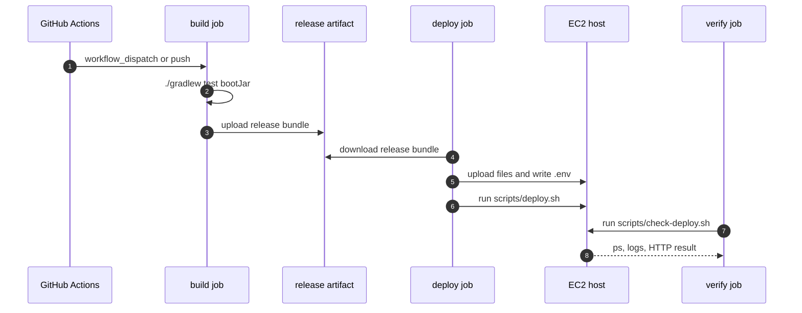
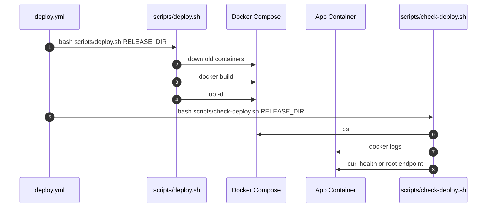
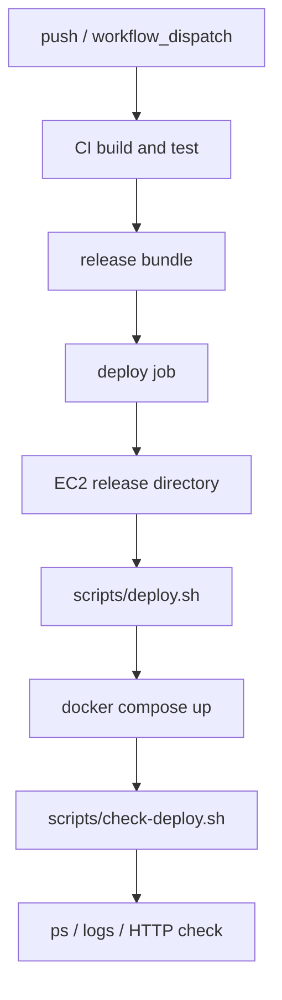

# 이론 정리

> 이번 시퀀스는 한 번 성공한 배포 흐름을 GitHub Actions workflow와 shell script로 반복 가능하게 고정하는 단계입니다.
> 핵심은 자동화를 빠른 배포 버튼으로만 보는 것이 아니라, build, test, deploy, verify의 실패 차단 지점과 성공 판정 기준을 파일로 남기는 것입니다.

## 1. Problem - 왜 운영 자동화가 필요한가

09 시퀀스에서 jar, Docker image, prod profile, compose 실행 흐름을 만들었습니다. 하지만 사람이 매번 같은 명령을 손으로 반복하면 순서가 흔들릴 수 있습니다.

자동화가 없으면 아래 문제가 생깁니다.

- 테스트가 실패했는데도 배포 명령을 실행할 수 있습니다.
- release bundle에 필요한 파일을 빠뜨릴 수 있습니다.
- SSH key, secret 주입, 서버 업로드 절차가 사람마다 달라질 수 있습니다.
- 배포 명령은 끝났지만 앱이 죽어 있는 상태를 성공으로 오해할 수 있습니다.
- 실패한 단계 뒤 작업이 계속 이어져 원인 파악이 어려워질 수 있습니다.

이번 시퀀스는 수동 배포 흐름을 workflow와 script로 나누어 고정하고, 실패하면 다음 단계로 넘어가지 않게 만드는 기준을 익힙니다.

## 2. Analyze - workflow와 script 책임을 어떻게 나눌 것인가

| 구분 | 책임 | 이번 코드에서 보는 곳 |
|---|---|---|
| CI workflow | build와 test를 먼저 확인합니다. | `.github/workflows/ci.yml` |
| Deploy workflow build job | release bundle을 만듭니다. | `.github/workflows/deploy.yml` |
| Deploy job | artifact를 서버에 업로드하고 deploy script를 실행합니다. | `deploy.yml`, `scripts/deploy.sh` |
| Verify job | 배포 후 상태, 로그, HTTP 응답을 확인합니다. | `deploy.yml`, `scripts/check-deploy.sh` |
| Scripts | 서버에서 반복 실행할 운영 명령을 담습니다. | `scripts/*.sh` |
| Secrets | 실제 비밀값을 코드 밖에서 주입합니다. | GitHub Secrets 이름 |

workflow는 “언제 어떤 순서로 실행할지”를 담당하고, script는 “서버에서 실제로 무엇을 실행할지”를 담당합니다. 이 둘을 나누면 YAML이 지나치게 길어지는 것을 줄이고, 서버 명령을 로컬에서도 점검할 수 있습니다.

## 3. API / 실행 시퀀스 다이어그램

### 3.1 build -> deploy -> verify 흐름

이 흐름에서 build가 실패하면 deploy는 실행되지 않아야 하고, deploy가 실패하면 verify도 실행되지 않아야 합니다. 자동화의 핵심은 성공 경로뿐 아니라 실패 차단 경로도 명확히 하는 것입니다.

### 3.2 script 책임 분리 흐름

deploy script는 “새로 띄우기”를 맡고, verify script는 “정말 살아 있는지 확인하기”를 맡습니다. 두 책임이 섞이면 배포 성공 판정이 흐려집니다.

## 4. 계층 / DTO / 메시지 흐름

이번 시퀀스는 API DTO보다 workflow artifact, secret 이름, shell argument가 메시지 역할을 합니다. 그래서 DTO 흐름은 “자동화 단계 사이에 어떤 산출물과 값이 전달되는가”로 읽습니다.

### 4.1 자동화 계층 흐름

| 계층 | 책임 | 직접 확인할 파일 |
|---|---|---|
| CI | 코드가 빌드되고 테스트되는지 확인합니다. | `.github/workflows/ci.yml` |
| Artifact | 배포에 필요한 파일 묶음을 전달합니다. | release bundle 구성 |
| Deploy | 서버에 파일을 올리고 재배포를 실행합니다. | `.github/workflows/deploy.yml`, `scripts/deploy.sh` |
| Verify | 배포 후 상태와 HTTP 응답을 확인합니다. | `scripts/check-deploy.sh` |
| Secrets | 서버 접속과 운영 설정 값을 주입합니다. | `secrets.*` 참조 |

### 4.2 자동화 메시지 흐름

| 메시지/산출물 | 출발 | 도착 | 목적 |
|---|---|---|---|
| jar | build job | release bundle | 실행 artifact 전달 |
| Dockerfile / deploy files | build job | EC2 release directory | 서버 build/compose 실행 |
| `.env` 내용 | GitHub Secrets | EC2 `.env` | prod 환경변수 주입 |
| `RELEASE_DIR` | workflow env | scripts | 서버 작업 디렉터리 통일 |
| `APP_IMAGE` | workflow env | `deploy.sh` | image 이름 통일 |
| HTTP check result | EC2 app | verify job | 배포 성공 판정 |

## 5. Action - 이번 구현에서 연결할 지점

### 5.1 CI로 build/test 고정

CI workflow는 배포 전에 `./gradlew test bootJar`가 통과하는지 확인합니다. build/test가 실패하면 배포가 진행되지 않아야 합니다.

확인 질문:

- push 또는 PR에서 어떤 branch 기준으로 CI가 실행되나요?
- `test bootJar`가 같은 step에서 실패하면 workflow가 멈추나요?
- CI 실패와 deploy 실패를 로그에서 구분할 수 있나요?

### 5.2 deploy workflow와 artifact

deploy workflow는 release bundle을 만들고, artifact로 전달한 뒤, EC2에 업로드합니다. 이 단계에서 빠진 파일이 있으면 서버 배포 script가 실패합니다.

확인 질문:

- release bundle에 jar, Dockerfile, env 예시, deploy 디렉터리, scripts가 포함되나요?
- artifact 업로드와 다운로드가 job 사이 연결을 담당하나요?
- SSH key는 Secrets에서 파일로 복원되고 권한이 제한되나요?

### 5.3 deploy/verify script 분리

`scripts/deploy.sh`는 컨테이너를 재배포하고, `scripts/check-deploy.sh`는 배포 결과를 확인합니다.

확인 질문:

- deploy script는 기존 컨테이너 정리, image build, compose up을 담당하나요?
- verify script는 `ps`, logs, HTTP 응답 확인을 담당하나요?
- verify 실패가 workflow 실패로 처리되나요?

## 6. Result - 무엇을 확인하고 어떤 한계가 남는가

이번 시퀀스를 마치면 아래를 설명할 수 있어야 합니다.

- CI와 CD의 차이
- build/test가 deploy보다 먼저 와야 하는 이유
- workflow job의 `needs`가 실패 차단을 만드는 방식
- artifact가 job 사이에서 파일을 전달하는 방식
- deploy script와 verify script의 책임 차이
- secret 값 자체가 아니라 secret 이름만 코드에 남겨야 하는 이유

남는 한계도 분명히 봅니다.

- 실제 EC2 접근, GitHub Secrets 설정, 운영 도메인/TLS는 로컬에서 완전히 검증하기 어렵습니다.
- rollback, blue-green, canary 같은 고급 배포 전략은 이번 범위가 아닙니다.
- verify endpoint를 더 정교하게 만드는 작업은 운영 성숙도에 따라 확장합니다.

## 7. 실무 포인트

- 자동화는 빠른 실행보다 실패를 멈추는 기준이 더 중요합니다.
- workflow 안에 모든 shell 명령을 길게 넣으면 리뷰와 재사용이 어려워집니다.
- script는 `set -euo pipefail`처럼 실패를 숨기지 않는 기본 설정이 필요합니다.
- deploy와 verify를 분리해야 “배포 명령 실행”과 “서비스 정상 기동”을 구분할 수 있습니다.
- secret 값은 로그에 나오지 않게 하고, workflow에는 secret 이름만 남깁니다.
- verify는 container 상태뿐 아니라 애플리케이션 응답까지 포함해야 합니다.

## 8. 용어 정리

### CI

- 뜻
  변경된 코드가 빌드되고 테스트되는지 자동으로 확인하는 흐름입니다.
- 왜 중요한가
  깨진 코드가 배포 단계로 넘어가는 것을 막습니다.
- 이번 코드에서는 어디에 보이는가
  `.github/workflows/ci.yml`
- 짧은 상황 예시
  PR이나 push에서 `./gradlew test bootJar`가 실패하면 배포 전 단계에서 멈춥니다.

### CD

- 뜻
  검증된 결과물을 실행 환경으로 전달하고 배포하는 흐름입니다.
- 왜 중요한가
  사람이 매번 같은 서버 명령을 손으로 반복하지 않게 합니다.
- 이번 코드에서는 어디에 보이는가
  `.github/workflows/deploy.yml`, `scripts/deploy.sh`
- 짧은 상황 예시
  release bundle을 EC2에 올리고 compose로 앱을 다시 띄웁니다.

### Artifact

- 뜻
  build 결과물과 배포에 필요한 파일을 묶은 산출물입니다.
- 왜 중요한가
  build job의 결과를 deploy job이 같은 기준으로 사용할 수 있습니다.
- 이번 코드에서는 어디에 보이는가
  release bundle, `actions/upload-artifact`
- 짧은 상황 예시
  jar, Dockerfile, deploy 디렉터리, scripts를 release bundle로 묶습니다.

### Verify

- 뜻
  배포 후 서비스가 실제로 살아 있는지 확인하는 단계입니다.
- 왜 중요한가
  배포 명령 종료와 서비스 정상 동작은 다른 기준이기 때문입니다.
- 이번 코드에서는 어디에 보이는가
  `scripts/check-deploy.sh`
- 짧은 상황 예시
  `docker logs`와 `curl --fail`로 컨테이너와 HTTP 응답을 확인합니다.

### Secret

- 뜻
  코드에 직접 쓰면 안 되는 운영 비밀값입니다.
- 왜 중요한가
  SSH key, DB password, JWT secret 같은 값이 Git에 남으면 보안 사고로 이어질 수 있습니다.
- 이번 코드에서는 어디에 보이는가
  `${{ secrets.EC2_SSH_KEY }}`, `${{ secrets.PROD_DB_PASSWORD }}`
- 짧은 상황 예시
  workflow에는 값 자체가 아니라 secret 이름만 남깁니다.

## 9. 다음 구현으로 연결되는 지점

`docs/implementation.md`에서는 CI, deploy workflow, `deploy.sh`, `check-deploy.sh`의 TODO를 채우며 자동화 흐름을 완성합니다. 구현 후에는 “어떤 단계가 실패하면 어디서 멈추는가”와 “verify가 무엇을 성공으로 판단하는가”를 설명해야 합니다.

멘토용 설명 포인트

- 멘티가 자동화를 “빠르게 배포하기”로만 이해하면 실패 차단과 성공 판정 기준으로 다시 설명합니다.
- workflow와 script를 나누는 이유를 수정 영향 범위와 재사용 관점에서 설명하게 합니다.
- verify가 빠진 자동화와 포함된 자동화의 위험 차이를 질문으로 비교합니다.
- secret 값 자체가 아니라 secret 이름과 주입 위치만 확인하게 합니다.

