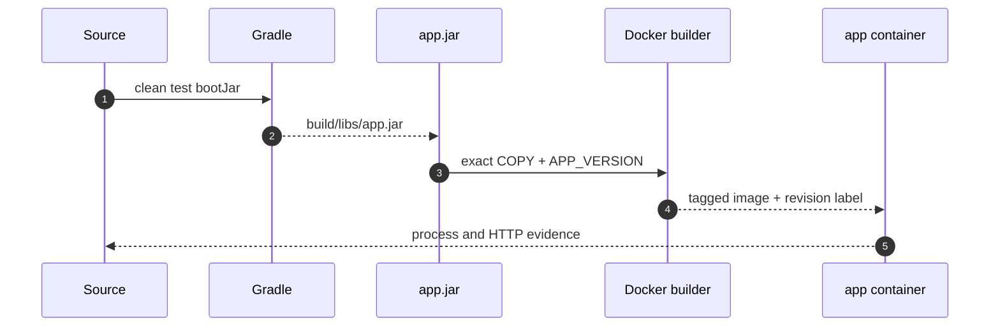
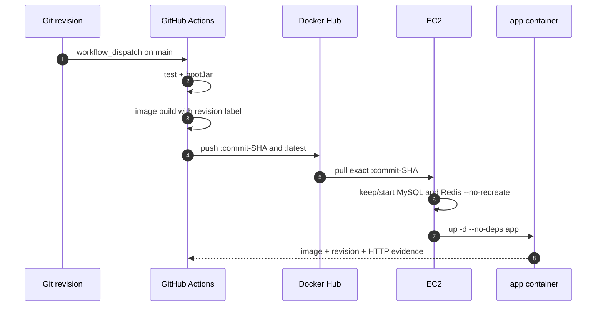

# Docker Runtime과 CI/CD 이론 정리

로컬에서 실행되는 source는 그대로 배포 단위가 되지 않습니다.
이번 랩은 검증된 source를 실행 가능한 JAR로 만들고, 같은 JAR를 담은 이미지를 Docker Hub를 통해 EC2까지 전달한 뒤 실제 실행 결과를 확인합니다.

<a id="seq-09"></a>

## 09. 재현 가능한 실행 단위를 만듭니다



| 단계 | 들어온 것 | 한 일 | 나간 것 또는 상태 |
| --- | --- | --- | --- |
| 1 | source와 test | `clean test bootJar` 실행 | 검증된 `app.jar` |
| 2 | `app.jar`와 Dockerfile | exact COPY와 revision label 기록 | tagged image |
| 3 | image와 runtime `.env` | Compose로 app process 시작 | running 또는 기동 실패 |
| 4 | 실행 중인 app | container와 HTTP 상태 확인 | runtime 성공 또는 첫 실패 경계 |

### JAR 이름은 하나로 고정합니다

Spring Boot 프로젝트는 executable JAR와 plain JAR가 함께 생길 수 있습니다.
Dockerfile이 wildcard로 두 파일 중 하나를 우연히 고르면 build 결과를 재현하기 어렵습니다.

이 레포는 다음 계약을 사용합니다.

- `bootJar` 결과는 `build/libs/app.jar`입니다.
- plain `jar` task는 비활성화합니다.
- Dockerfile은 `build/libs/app.jar`만 복사합니다.
- `.dockerignore`는 다른 build 결과를 제외하되 `app.jar`는 context에 포함합니다.

```text
source -> test -> build/libs/app.jar -> Dockerfile COPY -> image
```

JAR 파일명이 바뀌거나 파일이 없으면 Docker build가 바로 실패하므로 잘못된 산출물이 다음 단계로 넘어가지 않습니다.

### image에는 source revision을 남깁니다

Docker tag만으로는 컨테이너 안의 코드가 어느 commit에서 만들어졌는지 증명하기 어렵습니다.
그래서 image build 시 `APP_VERSION`을 전달하고 OCI label에 기록합니다.

```dockerfile
ARG APP_VERSION=local
LABEL org.opencontainers.image.revision="${APP_VERSION}"
COPY build/libs/app.jar /app/app.jar
```

로컬에서는 `local`, GitHub Actions에서는 `${GITHUB_SHA}`가 revision이 됩니다.
배포 검증은 tag뿐 아니라 이 label도 확인합니다.

### image와 runtime config의 책임은 다릅니다

image에는 실행 코드와 Java runtime을 넣습니다.
DB 비밀번호, JWT secret, OAuth client secret 같은 환경별 값은 image에 넣지 않고 Compose와 `.env`로 주입합니다.

| 구분 | 저장할 것 | 저장하지 않을 것 |
| --- | --- | --- |
| Docker image | `app.jar`, Java runtime, ENTRYPOINT, revision label | 운영 비밀번호와 token |
| Compose | service 관계, port, environment 변수 이름 | 실제 secret 값 |
| EC2 `.env` | 운영 DB, Redis, JWT, OAuth, Mail 값 | source와 JAR |

운영 `.env`는 EC2에 유지하고 `chmod 600`으로 접근을 제한합니다.

[Visual Lab에서 runtime 경계를 확인하기](./visual-lab/sequences/09/)

<a id="seq-10"></a>

## 10. image를 한 번 만들고 같은 결과를 배포합니다

EC2에서 JAR를 받아 image를 다시 만들면 Actions가 검증한 결과와 서버가 실행한 결과 사이에 새 build가 생깁니다.
이번 랩은 Actions가 image를 한 번만 만들고, Docker Hub가 그 image를 전달하도록 책임을 바꿉니다.



| 단계 | 들어온 것 | 한 일 | 나간 것 또는 상태 |
| --- | --- | --- | --- |
| 1 | source와 commit SHA | test, `bootJar`, image build | 검증된 SHA image |
| 2 | SHA image | Docker Hub에 SHA와 `latest` push | registry 배포 입력 |
| 3 | SHA tag와 EC2 runtime | exact pull, 의존 서비스 보존, app-only 갱신 | 새 app container |
| 4 | 실행 중인 app | image, revision, HTTP 검증 | workflow 성공 또는 verify 실패 |

### SHA tag가 배포 버전입니다

`${GITHUB_SHA}`는 workflow가 실행된 source revision을 가리킵니다.
Actions는 같은 image에 두 tag를 게시합니다.

| tag | 용도 |
| --- | --- |
| `${GITHUB_SHA}` | 실제 배포와 검증에 사용하는 불변 식별자 |
| `latest` | 사람이 최근 게시 이미지를 찾는 보조 별칭 |

`latest`는 새 게시 때 다른 image를 가리킬 수 있으므로 EC2 배포 입력으로 사용하지 않습니다.
배포 script는 SHA tag를 정확히 pull하고, verify script는 컨테이너의 image reference, image ID, revision label을 함께 확인합니다.

### gate는 실패 이후 단계를 닫습니다

```text
test + bootJar
  -> image publish
  -> EC2 deploy
  -> runtime verify
```

- test 또는 `bootJar`가 실패하면 image를 게시하지 않습니다.
- image 게시가 실패하면 SSH 배포를 시작하지 않습니다.
- deploy가 실패하면 verify를 시작하지 않습니다.
- image나 HTTP 검증이 실패하면 workflow 전체를 성공으로 판정하지 않습니다.

`needs`는 job 순서를 고정하고, deployment concurrency는 두 운영 배포가 동시에 EC2를 바꾸지 못하게 합니다.

### deploy는 앱만 갱신합니다

MySQL과 Redis는 09 runtime scaffold에서 준비하는 장기 상태 서비스입니다.
10의 배포는 전체 Compose stack을 내리지 않습니다.

```text
docker compose pull app
docker compose up -d --no-recreate mysql redis
docker compose up -d --no-deps app
```

실제 script는 Compose가 SHA image를 해석하도록 값을 export한 뒤 app service만 다룹니다.

```bash
export APP_IMAGE
docker compose --env-file .env -f deploy/compose.prod.yaml pull app
docker compose --env-file .env -f deploy/compose.prod.yaml up -d --no-recreate mysql redis
docker compose --env-file .env -f deploy/compose.prod.yaml up -d --no-deps app
```

기존 MySQL과 Redis container가 있으면 다시 만들지 않고, 없거나 멈춘 서비스는 기동합니다.
그 뒤 새 app image만 교체하므로 MySQL volume과 기존 데이터는 유지됩니다.
첫 운영 배포 전에 적어도 09 Compose scaffold와 runtime `.env`가 준비되어 있어야 하는 이유이기도 합니다.

### 성공 판정에는 실행 증거가 필요합니다

배포 명령이 종료됐다는 사실과 서비스가 정상이라는 사실은 다릅니다.
verify script는 다음 순서로 확인합니다.

1. app container가 `running`인지 확인합니다.
2. 선언된 image reference가 요청한 SHA tag인지 확인합니다.
3. container image ID가 host의 해당 SHA image ID와 같은지 확인합니다.
4. OCI revision label이 `${GITHUB_SHA}`와 같은지 확인합니다.
5. 제한된 횟수 안에 HTTP 성공 응답이 오는지 확인합니다.

실패하면 Compose 상태와 최근 app log를 출력해 첫 실패 경계를 찾습니다.

### secret은 사용 위치에 따라 나눕니다

| 위치 | 값 | 이유 |
| --- | --- | --- |
| GitHub Secrets | Docker Hub 계정/token, EC2 host/user/key/known_hosts | image 게시와 원격 접속에만 필요 |
| EC2 `.env` | DB, Redis, JWT, OAuth, Mail, URL 설정 | 애플리케이션 runtime에만 필요 |

Actions가 운영 `.env`를 매번 다시 쓰지 않으므로 긴 secret 목록이 workflow에 복제되지 않습니다.
배포 파일을 갱신해도 EC2의 `.env`는 그대로 남습니다.

### 가이드와 실제 서비스의 trigger는 다릅니다

이 레포의 `main`은 여러 시퀀스와 수업 문서를 함께 관리하는 가이드 브랜치입니다.
문서 수정만으로 실제 EC2가 바뀌지 않도록 deploy workflow는 `workflow_dispatch`만 허용하고 `main` 실행만 통과시킵니다.

실제 서비스 레포에서는 같은 gate를 유지한 채 검토를 통과한 `main` push를 배포 trigger로 매핑할 수 있습니다.
달라지는 것은 시작 조건이고, SHA image와 검증 계약은 같습니다.

## 조기 수업 운영

CI/CD를 09보다 먼저 설명해야 해도 공식 prerequisite는 `09`로 유지합니다.
학생이 Dockerfile과 운영 설정을 동시에 완성하느라 자동화 흐름을 놓치지 않도록 멘토가 다음 09 결과를 scaffold로 제공합니다.

- `build/libs/app.jar` 생성 계약
- Dockerfile과 `.dockerignore`
- `application-prod.yaml`
- `deploy/compose.prod.yaml`
- EC2 runtime `.env`
- 실행 중인 MySQL과 Redis

학생은 10에서 CI gate, registry 게시, exact image 배포, verify에 집중합니다.

## 남은 범위

이번 랩은 공개 Docker Hub 저장소, 단일 EC2, Docker Compose를 기준으로 합니다.
private registry 인증, rollback, Blue-Green, Canary, Kubernetes, Terraform, observability와 알림은 후속 운영 주제입니다.

[Visual Lab에서 CI/CD gate를 확인하기](./visual-lab/sequences/10/)
